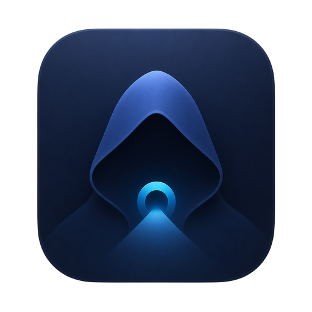

# Amnezia Cloak

[](https://github.com/maloyan/amnezia-cloak/actions/workflows/ci.yml)
[](https://github.com/maloyan/amnezia-cloak/releases)
[](./LICENSE)
[](https://swift.org)
[](https://www.apple.com/macos/)

<p align="center">
  
</p>

A minimal macOS menubar client for [AmneziaWG](https://github.com/amnezia-vpn/amneziawg-go) tunnels — list, toggle, import `.conf` files, paste `vpn://` share links, edit configs in place. Single target, ~350 lines of Swift, zero third-party dependencies.

## Features

- **Menubar-only** (`LSUIElement`) — no dock icon, no window chrome.
- **Import `.conf` files** from Finder, or paste `vpn://` share links directly from the Amnezia mobile app.
- **Pure-Swift `vpn://` decoder** — no python / jq / external tools at runtime.
- **Tunnel toggle** — click to connect, click again to disconnect; toggling to a new tunnel brings down the old one first.
- **In-place config editor** — opens the root-owned `.conf` via `sudo -n /bin/cat`, saves via the privileged helper.
- **Retina-sharp template icons** — auto-tint with light/dark menubar.
- **Ad-hoc signed DMG** — drag to `/Applications`, launch, done.

## Requirements

- macOS 11 or later.
- [`amneziawg-go`](https://github.com/amnezia-vpn/amneziawg-go) userspace daemon at `/usr/local/bin/amneziawg-go`.
- [`amneziawg-tools`](https://github.com/amnezia-vpn/amneziawg-tools) (`awg`, `awg-quick`) at `/usr/local/bin/`.

The privileged helper (`/usr/local/sbin/awg-helper`) and the matching sudoers rule are **installed automatically by the app on first launch** — you'll be prompted for your admin password once. No Terminal steps, no manual script running.

## Install

Grab the latest DMG from the [Releases page](https://github.com/maloyan/amnezia-cloak/releases), open it, drag `Amnezia Cloak.app` to `/Applications`, launch from Spotlight.

## Build from source

```sh
git clone https://github.com/maloyan/amnezia-cloak.git
cd amnezia-cloak
./build.sh
open "build/Amnezia Cloak.app"
```

Produces `build/Amnezia Cloak.app` and `Amnezia-Cloak.dmg` at the repo root.

## Development

```sh
brew install swiftlint swift-format
swift test                                                  # unit tests
swiftlint --strict                                          # lint
swift-format lint --recursive --strict Sources Tests        # format check
```

All three run in CI on every push and PR. See [`AGENTS.md`](./AGENTS.md) for layout, architectural rules, and runtime dependencies. [`CONTRIBUTING.md`](./CONTRIBUTING.md) has the PR checklist.

## How it works

```
┌─────────────────────────────────┐
│  Amnezia Cloak.app (menubar)    │
│   ┌────────────────────────┐    │      sudo -n awg-helper install/up/down/delete
│   │ AmneziaCloakApp        │──────┐   sudo -n /bin/cat  (read root-owned confs)
│   │  (Cocoa + main.swift)  │    │ └─────────────────────────┐
│   └────────┬───────────────┘    │                           │
│            │ imports            │                           ▼
│   ┌────────▼───────────────┐    │                ┌──────────────────────┐
│   │ AmneziaCloakCore       │    │                │ /usr/local/sbin/     │
│   │  Paths · Shell · …     │    │                │   awg-helper         │
│   │  TunnelName · VPNURL   │    │                │ (NOPASSWD sudoers)   │
│   │  Tunnel · Installer    │    │                └──────────┬───────────┘
│   └────────────────────────┘    │                           │
└─────────────────────────────────┘                           ▼
                                                   ┌──────────────────────┐
                                                   │ awg / awg-quick      │
                                                   │ /etc/amnezia/…/*.conf│
                                                   │ amneziawg-go         │
                                                   └──────────────────────┘
```

`AmneziaCloakCore` is UI-free so it can be tested on a headless CI runner. All privileged writes funnel through a single helper call site (`sudoHelper`) with an argument vector — there is no shell interpolation on the privileged path.

## Related projects

- [amnezia-vpn/amneziawg-go](https://github.com/amnezia-vpn/amneziawg-go) — userspace WireGuard with obfuscation.
- [amnezia-vpn/amneziawg-tools](https://github.com/amnezia-vpn/amneziawg-tools) — `awg` / `awg-quick` CLI.
- [amnezia-vpn/amnezia-client](https://github.com/amnezia-vpn/amnezia-client) — the reference Qt client; source of the `vpn://` share-link format implemented in `Sources/AmneziaCloakCore/VPNURL.swift`.

## License

[MIT](./LICENSE) © Narek Maloyan.
